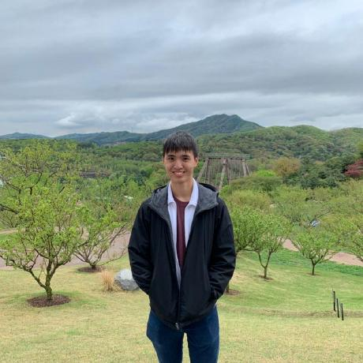
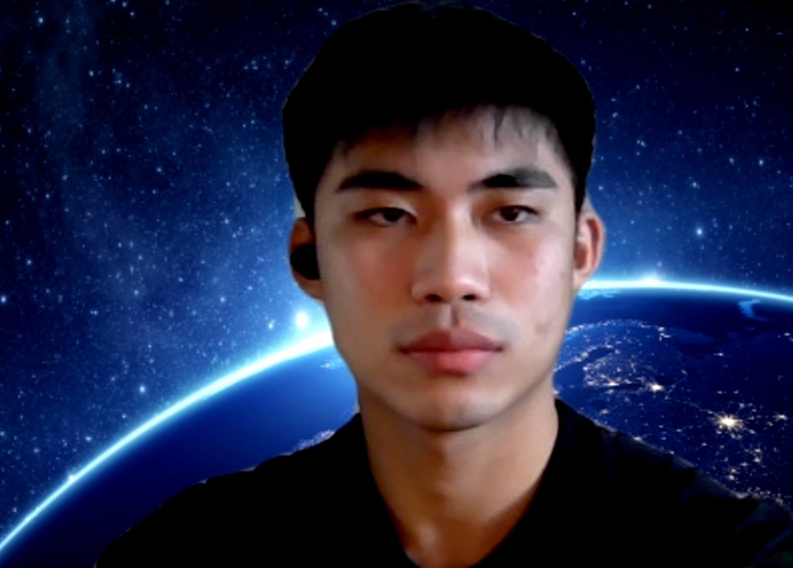
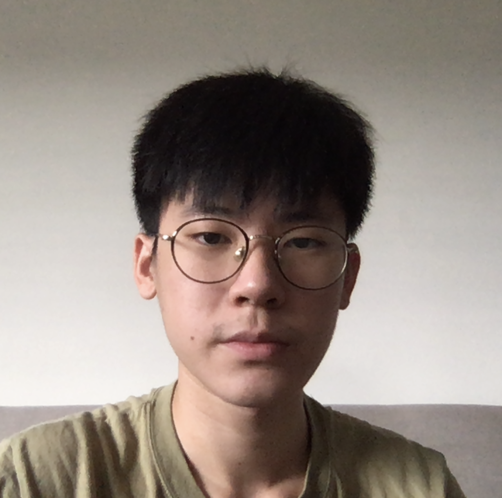

We are a team based in the [National University of Singapore, School of Computing](http://www.comp.nus.edu.sg).

You can reach us at the email `seer[at]comp.nus.edu.sg`

## Project team

### Kenneth Teo

[[homepage](http://www.comp.nus.edu.sg/~damithch)]
[[github](https://github.com/angrybunny123)]
[[portfolio](team/johndoe.md)]

* Role: Project Advisor

### Tan Le Yang

[[github](http://github.com/TanLeYang)]
[[portfolio](team/johndoe.md)]

* Role: Team Lead
* Responsibilities: UI

### Lee Penn Han

[[github](http://github.com/pennhanlee)]
[[portfolio](team/johndoe.md)]

* Role: Developer
* Responsibilities: Data

### Pang Wai Kye

[[github](http://github.com/pangpuncake)]
[[portfolio](team/johndoe.md)]

* Role: Developer
* Responsibilities:

### Le Minh Giang

[[github](http://github.com/mgiang2015)]

[[portfolio](team/johndoe.md)]

* Role: Developer
* Responsibilities: UI
