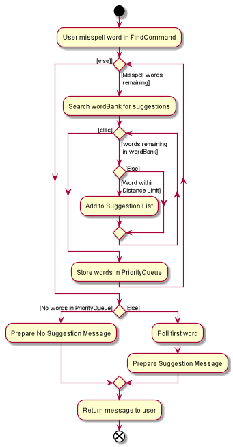
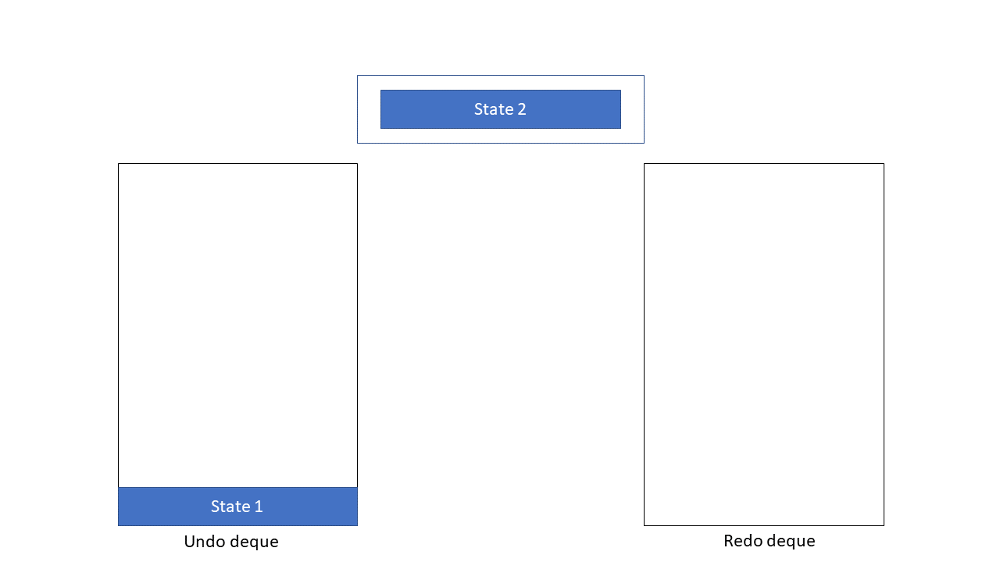

* Table of Contents
{:toc}

--------------------------------------------------------------------------------------------------------------------
## **Introduction**

### Purpose 

This document is written to describe the architecture and software design decisions for the desktop application, _bookmark_

### Scope

The goal of this document is to cover the high-level system architecture and design. It will also cover the implementation of each
feature in _bookmark_.

### Audience 

The intended audience is any person who is looking to understand the system architecture and design of _bookmark_

--------------------------------------------------------------------------------------------------------------------

## **Setting up, getting started**

Refer to the guide [_Setting up and getting started_](SettingUp.md).

--------------------------------------------------------------------------------------------------------------------

## **Design**

### Architecture

The ***Architecture Diagram*** given above explains the high-level design of the App. Given below is a quick overview of each component.

:bulb: **Tip:** The `.puml` files used to create diagrams in this document can be found in the [diagrams](https://github.com/AY2021S1-CS2103T-F13-2/tp/tree/master/docs/diagrams) folder. Refer to the [_PlantUML Tutorial_ at se-edu/guides](https://se-education.org/guides/tutorials/plantUml.html) to learn how to create and edit diagrams.

**`Main`** has two classes called [`Main`](https://github.com/AY2021S1-CS2103T-F13-2/tp/blob/master/src/main/java/seedu/bookmark/Main.java) and [`MainApp`](https://github.com/AY2021S1-CS2103T-F13-2/tp/blob/master/src/main/java/seedu/bookmark/MainApp.java). It is responsible for,
* At app launch: Initializes the components in the correct sequence, and connects them up with each other.
* At shut down: Shuts down the components and invokes cleanup methods where necessary.

[**`Commons`**](#common-classes) represents a collection of classes used by multiple other components.

The rest of the App consists of four components.

* [**`UI`**](#ui-component): The UI of the App.
* [**`Logic`**](#logic-component): The command executor.
* [**`Model`**](#model-component): Holds the data of the App in memory.
* [**`Storage`**](#storage-component): Reads data from, and writes data to, the hard disk.

Each of the four components,

* defines its *API* in an `interface` with the same name as the Component.
* exposes its functionality using a concrete `{Component Name}Manager` class (which implements the corresponding API `interface` mentioned in the previous point.

For example, the `Logic` component (see the class diagram given below) defines its API in the `Logic.java` interface and exposes its functionality using the `LogicManager.java` class which implements the `Logic` interface.

**How the architecture components interact with each other**

The *Sequence Diagram* below shows how the components interact with each other for the scenario where the user issues the command `delete 1`.

The sections below give more details of each component.

### UI component

**API** :
[`Ui.java`](https://github.com/AY2021S1-CS2103T-F13-2/tp/blob/master/src/main/java/seedu/bookmark/ui/Ui.java)

The UI consists of a `MainWindow` that is made up of parts e.g.`CommandBox`, `ResultDisplay`, `BookListPanel`, `StatusBarFooter` etc. All these, including the `MainWindow`, inherit from the abstract `UiPart` class.

The `UI` component uses JavaFx UI framework. The layout of these UI parts are defined in matching `.fxml` files that are in the `src/main/resources/view` folder. For example, the layout of the [`MainWindow`](https://github.com/AY2021S1-CS2103T-F13-2/tp/blob/master/src/main/java/seedu/bookmark/ui/MainWindow.java) is specified in [`MainWindow.fxml`](https://github.com/AY2021S1-CS2103T-F13-2/tp/blob/master/src/main/resources/view/MainWindow.fxml).

The `UI` component,

* Executes user commands using the `Logic` component.
* Listens for changes to `Model` data so that the UI can be updated with the modified data.

### Logic component

**API** :
[`Logic.java`](https://github.com/AY2021S1-CS2103T-F13-2/tp/blob/master/src/main/java/seedu/bookmark/logic/Logic.java)

1. `Logic` uses the `CommandParser` class to parse the user command.
1. This results in a `Command` object which is executed by the `LogicManager`.
1. The command execution can affect the `Model` (e.g. adding a book).
1. The result of the command execution is encapsulated as a `CommandResult` object which is passed back to the `Ui`.
1. In addition, the `CommandResult` object can also instruct the `Ui` to perform certain actions, such as displaying help to the user.

Given below is the Sequence Diagram for interactions within the `Logic` component for the `execute("delete 1")` API call.

:information_source: **Note:** The lifeline for `DeleteCommandParser` should end at the destroy marker (X) but due to a limitation of PlantUML, the lifeline reaches the end of diagram.

### Model component

**API** : [`Model.java`](https://github.com/AY2021S1-CS2103T-F13-2/tp/blob/master/src/main/java/seedu/bookmark/model/Model.java)

The `Model`,

* stores a `UserPref` object that represents the user’s preferences.
* stores the library data.
* stores a `WordBank` that contains instances of words in Library.
* exposes an unmodifiable `ObservableList<Book>` that can be 'observed' e.g. the UI can be bound to this list so that the UI automatically updates when the data in the list change.
* does not depend on any of the other three components.

:information_source: **Note:** An alternative (arguably, a more OOP) model is given below. It has a `Tag` list in the `Library`, which `Person` references. This allows `Library` to only require one `Tag` object per unique `Tag`, instead of each `Book` needing their own `Tag` object. 

### Storage component

**API** : [`Storage.java`](https://github.com/AY2021S1-CS2103T-F13-2/tp/blob/master/src/main/java/seedu/bookmark/storage/Storage.java)

The `Storage` component,
* can save `UserPref` objects in json format and read it back.
* can save the library data in json format and read it back.

### Common classes

Classes used by multiple components are in the `seedu.bookmark.commons` package.

--------------------------------------------------------------------------------------------------------------------

## **Implementation**

This section describes some noteworthy details on how certain features are implemented.

### Changing Ui view

#### Implementation

*bookmark's* UI supports two types of views: the default, **summarised view** which displays summarised information
regarding the books stored, and the **detailed view** which displays detailed information about a particular book.

`BookListPanel` `BookCard` as well as its corresponding subclasses `DetailedBookListPanel` and `DetailedBookCard` facilitates
the display of book information.
When in the summarised view, `MainWindow` renders `BookListPanel` which displays the book information using `BookCard`,
while in the detailed view, `DetailedBookListPanel` is rendered which displays the book information using
`DetailedBookCard`. As there is more information to display, `DetailedBookListPanel` will also use other components
such as `NoteCard` to display the notes added to the book, if any. 

Both `BookListPanel` and `DetailedBookListPanel` makes use of JavaFX's `ListView` to display the `BookCard` or `DetailedBookCard`
respectively.

The class diagram below shows the relevant classes involved:

##### Switching between the two views

`MainWindow` and `CommandResult` facilitates the switching between the two views.

`MainWindow#executeCommand()` initializes all changes to what is displayed by the UI by calling `Logic#execute()`
which returns a `CommandResult`. `MainWindow#executeCommand()` is called when user enters a command into the application.
From the returned `CommandResult`, `CommandResult#getViewType()` indicates how the UI should switch its view.
`CommandResult#getViewType()` returns a `ViewType`, of which there are three types: 
   * `ViewType.DEFAULT` - Instructs UI to switch to the default, summarised view
   * `ViewType.DETAILED` - Instructs UI to switch to the detailed, single book view
   * `ViewType.MOST_RECENTLY_USED` - Instructs UI to stay in whatever view it is in

Based on the type of `ViewType` returned by `CommandResult#getViewType()`, `MainWindow#resetView()`,
`MainWindow#changeToDetailedView()`, or no method is called accordingly.

The activity diagram below illustrates the flow of execution when the UI decides which view to use:

Below is a sequence diagram that shows a scenario whereby the UI switches from the default summarised view to the
detailed view:

#### Design considerations

##### Aspect: What to display DetailedBookCard with

* **Alternative 1 (current choice):** Use JavaFX ListView
  * Pros: Easy to keep UI up to sync with model by overriding ListCell's updateItem method
  * Cons: Extra care must be taken to not allow multiple books to be displayed as detailed view is only meant to show
  one book

* **Alternative 2:** Use other JavaFX layouts
  * Pros: More in-line with the purpose of the detailed view of showing only one book
  * Cons: More work has to be done to sync up the UI with the model.
  
### Find feature

#### Implementation
The find mechanism is facilitated by `ModelManager`, specifically, the `ModelManager#updateFilteredBookList()` method. 
`ModelManager#updateFilteredBookList()` takes in a single parameter, a `predicate`, and applies the `predicate` 
on all elements of the observable book list. Elements that satisfy the `predicate` remain in the 
list, while elements that do not are removed and omitted from the user's view. Currently, the `find` command 
supports finding by name, genre and tag fields, and can also filter completed & non-completed books.

Given below is an example usage scenario and how the find mechanism alters `FilteredList` at each step.

Step 1. The user launches the application for the first time. `FilteredList` is initialised with the user's book data.

Step 2. The user executes `find n/ Harry` command to find all books with Harry in the Name field. The `NameContainsKeywordsPredicate` predicate is generated
and used as a filter in this scenario.

#### Filtering the FilteredList
The `FindCommandParser#parse()` parses the `find` command input, and checks for input errors for which if found,
an error would be thrown. Subsequently, `FindCommandParser#predicateGenerator()` generates a predicate based on the 
user's input filtering prefix. The resulting `predicate` is used to generate a new `FindCommand` object, 
and when `FindCommand#execute()` is called, the `predicate` is passed on to `ModelManager#updateFilteredBookList()`,
where the filtering of the observable book list based on the `predicate` occurs. 

The activity diagram below illustrates the flow of execution when the user inputs a `find` command.

Below is a sequence diagram that shows a scenario whereby the user decides to find keywords in the book name field:
Command : `find n/ Harry`

#### Design considerations

##### Aspect: Finding within user specified field or in all fields

* **Alternative 1 (current choice):** Finding keywords within specified field
  * Pros: Allows the user to streamline their search and find their desired book quicker.
  * Cons: Could be a drawback if the user forgets which field he used the keyword in.
  
* **Alternative 2:** Finding keywords in all fields
  * Pros: Allows the user to find all books with the keyword in any input field, which could be an advantage if 
  the user uses the keyword for multiple fields.
  * Cons: Might not be easy to find specific books, i.e. cannot streamline the search as well.

### Add book

#### Implementation

*bookmark* allows Users to add books into the application.

This feature is facilitated mainly by `LogicManager`, `AddCommandParser` and `AddCommand`.

`LogicManager#execute()` handles the command word to create `AddCommandParser` to parse the remaining inputs.
`AddCommandParser#parse()` tokenizes each prefix to create a `Book` object. This `Book` object will be
passed as a parameter to create a `AddCommand` that will be returned to `LogicManager` 
*If there are missing or invalid prefixes, an exception will be thrown with a message to the User.*

`LogicManager#execute()` will call `AddCommand#execute()` to add the `Book` attribute into
the `Model`to return a `CommandResult` as a feedback to the user.
*If there is an existing book with the same name, an exception will be thrown with a message to the User*

Below is an activity diagram which illustrates the flow of events for adding a book

Below is a sequence diagram which illustrates the a scenario where a User adds a valid book  
Command: `add n/Harry Potter g/Fiction tp/1000 b/100`

### Suggestion feature

#### Implementation

*bookmark*'s Did you mean? feature uses the Damerau-Levenshtien algorithm to calculate the distance between the
user-input word and the words in the application Library.

The `Edit Distance` refers to the number of steps needed to change difference between two words. 
This mechanism is implemented through 3 operations: 
1. Addition
2. Deletion
3. Transposition (Swapping)

For example: 
* Hbrry -> Harry (Edit Distance: 1)
* Hrry -> Harry (Edit Distance: 1)
* Hrary -> Harry (Edit Distance 1)
* Haarry -> Harry (Edit Distance 1)

The suggestion mechanism is facilitated by `Logic` Component through `FindCommand` which calls on `SuggestionAlgorithm`.
`SuggestionAlgorithm` will call on `WordBank` in `Model` for the stored words required to complete the mechanism.
`SuggestionAlgorithm` will implement the following operations:
* `SuggestionAlgorithm#findSuggestions()` — Filters the relevant words to be returned as a suggestion
* `SuggestionAlgorithm#calculateDistance()` — Calculate the EditDistance of the source word and words in the WordBank

The class diagram below shows the relevant classes involved.

Given below is an example usage scenario and how a Suggestion mechanism behaves at each step.

Step 1: The user inputs the command `find n/h@rry` to find books with `harry` in their names.  
*harry is deliberately mispelled*  
`FindCommand` will implement `execute` and the `model`'s `FilteredList`  will be empty.

Step 2: `FindCommand` will call on `SuggestionAlgorithm#findSuggestions()` to find the closest matching word
in the appropriate `WordStore` of `WordBank`.

Step 3: `SuggestionAlgorithm#calculateDistance()` will be called to calculate the edit distance of `h@rry` and the words in `nameWordBank`
and store words that are within the predefined `DISTANCE_LIMIT`.

Step 4: `FindCommand#execute()` will add each word into a `PriorityQueue` and poll out the word with the smallest distance
to be used as the suggested word.

Step 4*: If no words are within the `DISTANCE_LIMIT` in Step 3, there will not be any words in the `PriorityQueue` and `FindCommand#execute()`
will return a Standard Message for no suggestion.

Below is a sequence diagram that shows a scenario where a suggestion is provided when a typing error is committed.

### Add Note feature

#### Implementation

*bookmark* allows Users to add notes to a book.

This feature is facilitated mainly by `AddNoteCommandParser` and `AddNoteCommand`.

`LogicManager#execute()` (not shown in the diagram above) handles the command word to create `AddNoteCommandParser` to parse the remaining inputs.
`AddNoteCommandParser#parse()` tokenizes each prefix to create a `Note` object. This `Note` object will be
passed as a parameter to create a `AddNoteCommand` that will be returned to `LogicManager`. 
*If there are missing or invalid prefixes, an exception will be thrown with a message to the User.*

`LogicManager#execute()` will call `AddNoteCommand#execute()` to add the `Book` with the added `Note` into
the `Model` and return a `CommandResult` as a feedback to the user.
*If there is an existing note with the same title and text, an exception will be thrown with a message to the User*

Below is an activity diagram which illustrates the flow of events for adding a book

Below is a sequence diagram which illustrates the a scenario where a User adds a valid note to a valid book 
Command: `note 1 n/Thoughts txt/Something`

### Undo/redo feature
#### Implementation

The undo/redo mechanism is facilitated by `HistoryManager`. `HistoryManager` manages the current model state as well as 
the states that can be undone/redone. It does so by storing `State` objects. Each `State` object contains a 
`ReadOnlyLibrary`, `ReadOnlyUserPrefs` and a `Predicate` used to decide which books should be visible to the user. 

* `HistoryManager#addNewState()` — Add a new state to be used as the current state
* `HistoryManager#undo()` — Restores the most recent previous state from its history.
* `HistoryManager#redo()` — Restores the most recently undone state from its history.

The undo and redo operations are exposed in the `Model` interface as `Model#undo()` and `Model#redo()` respectively.
Whenever the user enters one of the following commands:
  * `add`
  * `delete`
  * `edit`
  * `note`
  * `goal`
  * `sort`
  
the previous state
will be saved and a new state created by calling `HistoryManager#addNewState()`.
This occurs via the methods implemented by `ModelManager` to modify the model such as: `ModelManager#addBook()`, `ModelManager#removeBook()`,
`ModelManager#setBook()` and `ModelManager#setUserPrefs` are called. When these methods are called, they will
modify the model and call `HistoryManager#addNewState()` to create a new `State` capturing the state of the modified model,
to be stored by `HistoryManager`.
The class diagram below illustrates the classes that facilitates the undo and redo
feature.

#### How state is managed

`HistoryManager` manages state by keeping a current state variable as well as two deques, an undo deque and a redo deque.
The undo deque stores the states to be recovered via an undo command, while the redo deque stores previously undone states 
to be recovered via a redo command. Below is an example to illustrate how `HistoryManager` manages state.

Step 1. The user launches the application for the first time. The `HistoryManager` will be inititalised with the
initial state of the model as the current state, i.e State 1. Undo and redo deques will be empty.

Step 2. The user executes add command to add a new book. This command will call the `Model#addBook()` method
which in turn will call the `HistoryManager#addNewState()` method, causing a new state, State 2 to be created and saved
as the current state. The previous current state, State 1, will be pushed into the undo deque.

:information_source: **Note:** If a command fails its execution, it will not call `HistoryManager#addNewState()`, so the state will not be saved.

Step 3. The user decides that adding the book was a mistake and decides to undo the action by using the undo command.
This causes the current state, State 2 to be pushed to the redo deque. State 1 will be popped from the undo deque and 
made the current state.

The following sequence diagram shows how the undo operation works:

Step 4. The user changes his mind again, deciding that he wants to add the book. He redoes the action by using the redo
command, causing the current state, State 1 to be pushed back into the undo deque and State 2 to be popped from the redo
deque and made the current state.

:information_source: **Note:** If the undo deque or redo deque is empty
when the user tries to undo and redo respectively, an error will be shown and no state change will occur.

Step 5. The user then decides to execute the command `list`. Commands that only change which books are displayable to 
the user such as `list`, `view` or `find` will not create new states.

Step 6. Now suppose the user adds a book and then edits a book, causing State 3 and State 4 to be created. He then
undoes the edit command. `HistoryManager` will now look like this:

Step 7: The user decides to then delete a book, causing State 5 to be created and made the current state.
The previous current state, State 3, will be pushed into the undo deque while the redo deque is cleared and 
hence State 4 is deleted.

This design choice of clearing the redo deque when a new state is added was made because states existing in the redo deque
cannot be represented in a linear, sequential path together with newly added states. Hence, it will be confusing
to allow users to redo to these states. To see this, we can plot the evolution of state changes in a sequential manner: 

To get a clearer picture, we consider what could occur if the redo deque is not 
cleared upon adding new state into the `HistoryManager`. 

Consider a scenario where the redo deque originally contains some state. The user subsequently enters 
5 commands that each create a new state and the redo deque is never cleared upon new states being added.
Then, the user enters the redo command, causing the top-most state in the redo deque to be popped and made the current state. 
As a result, all the changes that the user has done through the 5 commands are removed in a single redo command, 
which is not the intended behaviour.

Furthermore, to prevent excessive memory usage, a cap on the number of states stored by `HistoryManager`'s undo deque
can be set in `HistoryManager#MAX_UNDO_COUNT`. If a new state is added but the undo deque is already at max capacity,
then the oldest state in the undo deque will be deleted to make room. The activity diagram below explains the flow of
execution when a new state is added.

#### Design consideration:

##### Aspect: How undo & redo executes

* **Alternative 1 (current choice):** Saves copies of the entire `Library` and `UserPrefs`.
  * Pros: Easy to implement.
  * Cons: May have performance issues in terms of memory usage.

* **Alternative 2:** Individual command knows how to undo/redo by
  itself.
  * Pros: Will use less memory (e.g. for `delete`, just save the book being deleted).
  * Cons: We must ensure that the implementation of each individual command are correct, complexity builds up as more
  commands are added.
  
Alternative 1 was eventually chosen as there was no noticable performance degradation during testing with a reasonable 
cap (10) on the number of states stored. It is also much more scalable and less prone to breaking upon addition
or modification of commands. 

##### Aspect: How to decide which actions should create and save state

* **Alternative 1 (current choice):** The methods implemented by `ModelManager` to modify the model also creates and 
    save state.
  * Pros: Better separation of concerns, the model is responsible for deciding what actions constitute a modification
    and thus warrants the creation and saving of state.
  * Cons: The creation and saving of state becomes a side effect, not immediately clear that it occurs.
  
* **Alternative 2:** Expose a method in the `Model` interface that when called creates and saves state.
  * Pros: More declarative, easier to see when the model will create and save state.
  * Cons: Worse separation of concerns, the responsibility of deciding when to create and save state is moved away 
    from the model and to the components that interact with the model.
    
Alternative 1 was eventually chosen as we liked the clear separation of concerns it provides. We also feel that it is 
less prone to errors such as forgetting to call the hypothetical "save" method that would exist in alternative 2, 
or calling it in the wrong places, especially when more commands are added.

--------------------------------------------------------------------------------------------------------------------

## **Documentation, logging, testing, configuration, dev-ops**

* [Documentation guide](Documentation.md)
* [Testing guide](Testing.md)
* [Logging guide](Logging.md)
* [Configuration guide](Configuration.md)
* [DevOps guide](DevOps.md)

--------------------------------------------------------------------------------------------------------------------

## **Appendix: Requirements**

### Product scope

**Target user profile**:

* has a need to keep track of pages stopped at for multiple books
* has a need to keep track of library loans
* prefer desktop apps over other types
* can type fast
* prefers typing to mouse interactions
* is reasonably comfortable using CLI apps

**Value proposition**: manage bookmarks and library loans faster than a typical mouse/GUI driven app. Removes the need for physical bookmarks and loan receipts.

### User stories

Priorities: High (must have) - `* * *`, Medium (nice to have) - `* *`, Low (unlikely to have) - `*`

| Priority | As a …​                                    | I want to …​                                                                 | So that I can…​                                                         |
| -------- | ------------------------------------------ | -------------------------------------------------------------------------- | ---------------------------------------------------------------------- |
| `* * *`  | user                                       | see all the data of the book                                               | get information about the book                                         |
| `* * *`  | user                                       | add a new book                                                             | track my progress                                                      |
| `* * *`  | user                                       | delete a book                                                              | remove books that I no longer read                                     |
| `* * *`  | user                                       | find a book by name                                                        | locate details of books without having to go through the entire list   |
| `* * *`  | user                                       | see all the data about a particular book (title, bookmark, progress)                                                        | locate details of books without having to go through the entire list   |
| `* * *`  | user                                       | view a list of all the books and their progress                            | conveniently check my progress on all my books                         |
| `* * *`  | user                                       | update the data of a book                                                  |                                                                        |
| `* *`    | user                                       | classify my books according to genre                                       | organise my books better                                               |
| `* *`    | analytical user                            | write down my thoughts on a book                                           | re-read my analysis later                                              |
| `* *`    | user                                       | create my own classifications for genres not in the application            | organise the books to my liking                                        |
| `* *`    | Kindle user                                | have a clearer representation of my progress                               | conveniently get my progress without navigating to the Kindle screen   |
| `* * *`  | forgetful user                             | keep track of my loan expiry                                               | remember to return the book or extend the loan                         |
| `*`      | user                                       | have a visual representation of my loans expiry period                     | instantly know the urgency of each loan                                |
| `*`      | user                                       | set reminders for a book loan                                              | be reminded to return my book on time                                  |
| `* *`    | user                                       | place tags or notes at different pages                                     | stop using sticky notes                                                |
| `* * *`  | user                                       | have an easy interface                                                     | easily navigate through the system with minimal difficulty             |
| `* * *`  | user                                       | have a help page                                                           | find out how to use the app                                            |
| `* *`    | user                                       | have a few functions that I can use seamlessly                             | learn the app easily without bothering with large numbers of functions |
| `* *`    | user                                       | be able to edit my tags and reflections                                    | edit mistakes and typos                                                |
| `* *`    | careless user                              | undo any wrong commands that i’ve entered                                  |                                                                        |
| `*`      | user                                       | have colour coded tags                                                     | so that I can easily differentiate important tags from the rest        |
| `*`      | user                                       | customise the look of the application                                      | make it feel personal                                                  |
| `*`      | user                                       | have a summary page for statistics on the books I've read                  |                                                                        |
| `*`      | user                                       | be able to resize the application                                          | fit it to different screens                                            |
| `* *`    | user                                       | be able to filter my books by Lexicographic order, Date, Reading, Finished | get the information I'm looking for                                    |
| `*`      | user                                       | see and modify my current settings                                         |                                                                        |
| `* * *`  | user                                       | have a home page that summarises important details                         | conveniently access the most important information                     |
| `* *`    | beginner user                              | have default settings                                                      | skip configuring them at the start                                     |
| `*`      | user                                       | customise the background by uploading my own photo                         | get the information I'm looking for                                    |

### Use cases

(For all use cases below, the **System** is `bookmark` and the **Actor** is the `user`, unless specified otherwise)

**Use case: UC01 - Add a book**

**MSS**

1. User requests to add a book.
2. bookmark adds the book.

    Use case ends

**Extensions**

* 1a. User provides the wrong code.

    * 1a1. bookmark returns an error message.

    Use case ends.

* 1b. User provides a non-numeral for total pages or bookmarked page.

    * 1b1. bookmark returns an error message.

    Use case ends.

* 1c. Provided bookmarked page is larger than total pages.

    * 1c1. bookmark returns an error message.

    Use case ends.

**Use case: UC02 - View a book**

**MSS**

1. User <u>requests to list all books (UC05)</u>.
2. User requests to view a specific book using its index on list.
3. bookmark returns title, bookmark and progress of the book to user.

    Use case ends.

**Extensions**

* 2a. The index given is invalid.

    * 3a1. bookmark returns an error message.

      Use case resumes at step 2.

**Use case: UC03 - Delete a book**

**MSS**

1.  User <u>requests to list all books (UC05)</u>.
2.  User requests to delete a specific book using its index on list.
3.  bookmark deletes the book.

    Use case ends.

**Extensions**

* 2a. The index given is invalid.

    * 2a1. bookmark returns an error message.

      Use case resumes at step 2.

**Use case: UC04 - Edit a book**

**MSS**

1. User <u>requests to list all books (UC05)</u>.
2. User requests to edit a specific book using its index on list.
3. The requested entry is updated

    Use case ends.

**Extensions**

* 2a. The index given is invalid

    * 2a1. bookmark returns an error message

    Use case resumes at step 2.

 * 2b. The requested entry to update is invalid

    * 2b1. bookmark returns an error message

    Use case resumes at step 2.

 * 2c. The provided value for the entry to update is invalid

    * 2c1. bookmark returns an error message

    Use case resumes at step 2.

**Use Case: UC05 - List all books**

**MSS**

1. User requests to list all books
2. bookmark returns a list of books

    Use case ends

**Extensions**

* 1a. The book list is empty
    * 1a1. bookmark returns a message informing user that book list is empty

    Use case ends

**Use Case: UC06 - Help**

**MSS**

1. User requests to see the Help page
2. bookmark returns the Help page

    Use case ends

### Non-Functional Requirements

1.  Should work on any _mainstream OS_ as long as it has Java `11` or above installed.
2.  Should be able to hold up to 1000 books without a noticeable sluggishness in performance for typical usage.
3.  A user with above average typing speed for regular English text (i.e. not code, not system admin commands) should be able to accomplish most of the tasks faster using commands than using the mouse.
4.  The user interface should be self-explanatory and intuitive for first time users.
5.  The app should give proper indications to user when user action is in an invalid format.
6.  The app should be accessible via the downloaded JAR file without any other installations needed.

*{More to be added}*

### Glossary

* **Mainstream OS**: Windows, Linux, Unix, OS-X
* **Private contact detail**: A contact detail that is not meant to be shared with others

--------------------------------------------------------------------------------------------------------------------

## **Appendix: Instructions for manual testing**

Given below are instructions to test the app manually.

:information_source: **Note:** These instructions only provide a starting point for testers to work on;
testers are expected to do more *exploratory* testing.

### Launch and shutdown

1. Initial launch

   1. Download the jar file and copy into an empty folder

   1. Double-click the jar file Expected: Shows the GUI with a set of sample contacts. The window size may not be optimum.

1. Saving window preferences

   1. Resize the window to an optimum size. Move the window to a different location. Close the window.

   1. Re-launch the app by double-clicking the jar file. 
       Expected: The most recent window size and location is retained.

1. _{ more test cases …​ }_

### Deleting a book

1. Deleting a book while all books are being shown

   1. Prerequisites: List all books using the `list` command. Multiple books in the list.

   1. Test case: `delete 1` 
      Expected: First contact is deleted from the list. Details of the deleted contact shown in the status message. Timestamp in the status bar is updated.

   1. Test case: `delete 0` 
      Expected: No book is deleted. Error details shown in the status message. Status bar remains the same.

   1. Other incorrect delete commands to try: `delete`, `delete x`, `...` (where x is larger than the list size) 
      Expected: Similar to previous.

1. _{ more test cases …​ }_

### Saving data

1. Dealing with missing/corrupted data files

   1. _{explain how to simulate a missing/corrupted file, and the expected behavior}_

1. _{ more test cases …​ }_
