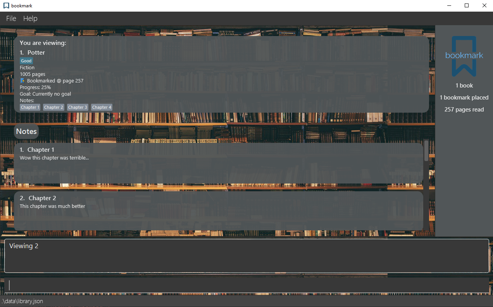

_bookmark_ is a desktop application to manage your indulgent bookworm habits! Use _bookmark_ to track your book reading progress 
or pen down thoughts of mindboggling fan theories about your favourite characters!

_bookmark_ allows you to add and update your beloved books, track your reading progress using our bookmark and even add reading goals and notes to your chosen books!

Guess what? _bookmark_ also uses the special Command Line Interface style so if you love to type, you're in luck! So 
get cracking and start saving your best reads and ideas into _bookmark_, Type away!~

* Table of Contents
{:toc}

--------------------------------------------------------------------------------------------------------------------

## Quick start

### Installation

1. Ensure you have Java `11` or above installed in your Computer.

1. Download the latest `bookmark.jar` from [here](https://github.com/AY2021S1-CS2103T-F13-2/tp/releases).

1. Copy the file to the folder you want to use as the _home folder_ for _bookmark_.

### Starting _bookmark_

1. Double-click the `bookmark.jar` file to start the application.  
*If you're starting _bookmark_ for the first time, you will see some sample books! Simply delete them with our delete command if you want a fresh start!*

1. Add your first book!   Invoke your first command by typing this in the input box located at the bottom of the application.  
`add n/My First Book g/Non-Fiction t/Yay tp/1000` 

1. You should see that My First Book will be added into the list of books you see! 

### The _bookmark_ Tour

Here's a brief tour of the _bookmark_ application!  
When you open _bookmark_, you will greeted by our lovely bookshelf GUI in a few seconds. (Exhibit 1)
    
   
   *Exhibit 1*
   
You can find a list of all your recorded books at the the main window. (Exhibit 2)  
The books only show
a condensed version of your books. Notes and Goals will be shown when you view a chosen book!

   
   
You can also see data of the summary of all your stored books, bookmarks and pages read on the
right side of the application window. (Exhibit 3)

   
   
You can start to invoke commands by typing them in the provided input box at the bottom of 
the application window. (Exhibit 4)  
 _bookmark_ will reply you with the appropriate response for each command.

   

 Want to do more? Refer to the [Features](#features) section below for details of many more commands!

--------------------------------------------------------------------------------------------------------------------
## Prefixes

Before diving into the features, this section will provide you with some
information on what each prefix used in the features below represent.

Prefix | Explanation
-------|------------
`n/` | Name of the book / Title of the note to add to a book
`g/` | Genre of the book
`t/` | Tag attached to a book
`tp/` | Total pages of the book
`b/` | The page where the bookmark is placed at
`c/` | Completed books
`nc/` | Not yet completed books
`rp/` | The reading progress of the book
`p/` | The page to set the your goal
`d/` | The date to complete your goal by
`txt/` | The text of your note

## Features

**:information_source: Notes about the command format:** 

* Words in `UPPER_CASE` are the information to be given by you. 
  e.g. in `add n/BOOK_TITLE`, `BOOK_TITLE` refers to the name of the book you want to add.

* Words in square brackets are optional. 
  e.g `n/BOOK_TITLE [b/PAGE_NUMBER]` means that you can omit this if you do not want to include a bookmark. 
  You can always edit the book to have that information at a later time.

* Words with trailing `…` refers to fields that can be used multiple times. 
  e.g. `[t/TAG]…​` can be used as ` ` (i.e. 0 times), `t/friend`, `t/friend t/family` etc.

* You can enter your book information in any order you like. 
  e.g. If our command instructions specify `n/BOOK_TITLE tp/TOTAL_PAGES`, `tp/TOTAL_PAGES n/BOOK_TITLE` is also acceptable.

### Adding a bookmark: `add`

Adds your book into _bookmark_ by using our Add Command so that you can
track your book reading progress together with us!

Format:  
 `add n/BOOK_TITLE g/GENRE [t/TAG]... tp/TOTAL_PAGES [b/PAGE_NUMBER]`  
*tags and bookmarks are optional!*

Examples:

Example Command | Result
-----------------|--------
`add n/Fifty Shades of Gray g/Romance tp/350 b/200` | Adds a book named `Fifty Shades of Gray`, with genre `Romance`, with `350` total pages, bookmarked at page `200`
`add n/Harry Potter and the Chamber of Secrets g/Fiction t/Wizards tp/1500 b/25` | Adds a book named `Harry Potter and the Chamber of Secrets`, with genre `Fiction`, with a tag `Wizards`, with `1500` total pages, bookmarked at page `25`

### Viewing details of a book : `View`

Want a closer look? Look at the detailed information of your recorded book by using our 
View Command.  
With this command, you can see your recorded book contents in detail.

Format: `view INDEX`
* View the title, bookmark and percentage completed, goal and notes added of a specified book.
* The `INDEX` refers to the index number shown in the displayed book list.
* The `INDEX` **must be a positive number** 1, 2, 3, …

Example:  
*This assumes you are tracking at least 2 books.*  

1. `list`
2. `view 2`

   

### Listing all books : `list`

Want to see all your books in storage? Use the List Command to display all
of the books that you have added since the day you started!

Format: `list`

    

### Locating books: `find`

Looking for something? Use the Find Command to search for your book of choice
by filtering your list of books to only those that you want. 

Format: `find {Field}`  

{Field} refers to any of these listed below:
* `find n/BOOK_TITLE` : find by input book name
* `find g/GENRE` : find by input book genre
* `find t/TAG` : find by input tag
* `find c/` : find by completed books
* `find nc/` : find by uncompleted books

Examples:

Example Command | Result
-----------------|--------
`find n/ ant bear` | Returns a list of books that contain `ant` and/or `bear` in its name.
`find t/ dog cat` | Returns a list of books that contain `dog` and/or `cat` in its tags.
`find c/` | Returns a list of completed books.

### Sorting books: `sort` 

Sort books according to the condition inputted, and sets it as a user preference.

Format: 
*`sort n/`
*`sort g/`
*`sort b/`
*`sort rp/`

Purpose:
* Sorts the books according to the input filter.
* Supports sorting by Name, Genre, Bookmarked page and Reading progress.

Examples:
Example Command | Result
-----------------|--------
`sort n/` | Returns a list of books sorted by name in alphabetical order.
`sort g/` | Returns a list of books sorted by genre in alphabetical order.
`sort b/` | Returns a list of books sorted by ascending number of pages read.
`sort rp/` | Returns a list of books sorted by ascending reading progress.

### Deleting a book : `delete`

Deletes the specified book from _bookmark_.

Format: `delete INDEX`

* Deletes the book at the specified `INDEX`.
* The `INDEX` refers to the index number shown in the displayed book list.
* The `INDEX` **must be a positive number** 1, 2, 3, …

Examples:

Example Command | Result
-----------------|--------
`list` followed by `delete 2` | deletes the 2nd book in the book list.

### Editing a book : `edit`

Edits an existing book in _bookmark_ so that you can update information of a book without having to delete the outdated version and add the updated book.

Format: `edit INDEX [n/BOOK_TITLE] [tp/TOTAL_PAGES] [b/PAGE_NUMBER] [g/GENRE] [t/TAG]`

* Edits the book at the specified `INDEX`.
* The `INDEX` refers to the index number shown in the displayed book list.
* The `INDEX` **must be a positive number** 1, 2, 3, …​
* At least one of the optional fields must be provided.
* Existing values will be updated to the input values.

Examples:

Example Command | Result
-----------------|--------
`edit 1 b/101` | Edits the bookmark of the 1st book to be `101`.
`edit 2 n/Harry Potter g/Fantasy` | Edits the name and genre of the 2nd book to `Harry Potter` and `Fantasy` respectively.

### Set goal for your book: `goal`

Set a reading goal to finish a certain page by a deadline for a book in _bookmark_.

Format: `goal INDEX p/PAGE d/DD-MM-YYYY`

* Sets goal for the book at the specified `INDEX`.
* The `INDEX` refers to the index number shown in the displayed book list.
* The `INDEX` **must be a positive number** 1, 2, 3, …
* Page number and deadline must be provided.

Examples:

Example Command | Result
-----------------|--------
`goal 1 p/69 d/22-05-2020` | Sets a goal to reach page 69 of the 1st book by 22nd May 2020.

### Adding a note to a book : `note`

Adds a note to an existing book in _bookmark_ so that you can pen down your thoughts or keep track of important information for the book.

Format: `note INDEX n/TITLE txt/TEXT`

* Edits the book at the specified `INDEX`.
* The index refers to the index number shown in the displayed book list.
* The index **must be a positive number** 1, 2, 3, …​
* `TITLE` and `INDEX` must not start with a whitespace.
* `TITLE` is limited to 1 to 120 characters.
* `TEXT` is limited to 1 to 1000 characters.

Examples:

Example Command | Result
-----------------|--------
`note 1 n/Thoughts txt/What is he thinking!` | Adds a note to the first book shown with the title `Thoughts` and text `What is he thinking!`

### Deleting a note from a book : `notedel`

Deletes a note from an existing book in _bookmark_ so that you can remove outdated, unwanted notes that may clutter your workspace.

Format: `notedel INDEX NOTE_INDEX`

* Deletes the note at the specified `NOTE_INDEX` of the book specified at `INDEX`.
* The `INDEX` refers to the index number shown in the displayed book list.
* The `NOTE_INDEX` refers to the index number shown in the displayed notes in the detailed view.
* All indexes **must be a positive number** 1, 2, 3, …​

Examples:

Example Command | Result
-----------------|--------
`notedel 1 3` | Deletes the 3rd note of the 1st book displayed
`notedel 4 2` | Deletes the 4th note of the 2nd book displayed

### Undoing a command : `undo`

Undoes the last command that you made. Can be used multiple times consecutively to undo up to ten 
commands entered.

**:information_source: About commands that can be undone:** 

* Only certain commands can be undone.  

* These commands include the following:  
  * `add`
  * `delete`
  * `edit`
  * `note`
  * `notedel`
  * `goal`
  * `sort`

The undo command will not execute if there are no commands available to undo. Once you close _bookmark_, the commands
entered during your usage session cannot be undone using the `undo` command the next time you start _bookmark_ again.

### Redoing a command: `redo`

Redoes the last command that you have undone. Can be used multiple times consecutively to redo up to ten 
undone commands. This command is to be used in conjunction with the [undo](#undoing-a-command--undo) command.

The redo command will not execute if there are no undone commands available to undo. Once you close _bookmark_, the
commands that you have undone during your usage session cannot be redone using the `redo` command the next time you
start _bookmark_ again.

### Clearing all books : `clear` [coming soon]

Clears all books from the Storage Library.

Format: `clear`

### Exiting the program : `exit`

Exits the program.

Format: `exit`

### Saving the data

_bookmark_ data will be saved in the hard disk automatically after any command that changes the data. There is no need to save manually.

### Accessing Help : `help`

Opens the Help Window where the available commands are shown with examples and images

Format: `help`

### Suggestions for Typing Error

When a typing error is made while trying to find a book  
eg. `find n/Hsrry` instead of `find n/Harry`

_bookmark_ will recommend the likely word that has been misspelled.

--------------------------------------------------------------------------------------------------------------------

## FAQ

**Q**: How do I transfer my data to another Computer? 
**A**: Install the app in the other computer and overwrite the empty data file it creates with the file that contains the data of your previous bookmark home folder.

**Q**: How can I know more about the available commands that _bookmark_ supports? 
**A**: Type `help` to open up the Help Window where the available commands will be shown.

--------------------------------------------------------------------------------------------------------------------

## Command summary

Action | Format
--------|------------------
**Add** | `add n/BOOK_TITLE g/GENRE [t/TAG] tp/TOTAL_PAGES [b/PAGE_NUMBER]`
**Clear** | `clear`
**Delete** | `delete INDEX`
**List** | `list`
**View** | `view INDEX`
**Edit** | `edit INDEX [n/BOOK_TITLE] [tp/TOTAL_PAGES] [b/PAGE_NUMBER] [g/GENRE] [t/TAG]`
**Goal** | `goal INDEX p/PAGE d/DD-MM-YYYY`
**Add Note** | `note INDEX n/TITLE txt/TEXT`
**Delete Note** | `notedel INDEX NOTE_INDEX`
**Find** | `find n/BOOK_TITLE`, `find g/GENRE`, `find t/TAG`, `find c/`, `find nc/`
**Sort** | `sort n/`, `sort g/`, `sort b/`, `sort rp/`
**Help** | `help`
