_bookmark_ is a desktop application to manage your indulgent bookworm habits! Use _bookmark_ to track your book reading progress 
or pen down thoughts of mindboggling fan theories about your favourite characters!

_bookmark_ allows you to add and update your beloved books, track your reading progress using our bookmark and even add reading goals and notes to your chosen books!

Guess what? _bookmark_ also uses the special Command Line Interface style so if you love to type, you're in luck! So 
get cracking and start saving your best reads and ideas into _bookmark_, Type away!~

* Table of Contents
{:toc}

--------------------------------------------------------------------------------------------------------------------

## Quick start

### Installation

1. Ensure you have Java `11` or above installed in your Computer.

1. Download the latest `bookmark.jar` from [here](https://github.com/AY2021S1-CS2103T-F13-2/tp/releases).

1. Copy the file to the folder you want to use as the _home folder_ for _bookmark_.

### Starting _bookmark_

#### Windows Users
1. Double-click the `bookmark.jar` file to start the application.  
*If you're starting _bookmark_ for the first time, you will see some sample books! Simply delete them with our delete command if you want a fresh start!*

1. Add your first book!   Invoke your first command by typing this in the input box located at the bottom of the application.  
`add n/My First Book g/NonFiction t/Yay tp/1000` 

1. You should see that My First Book will be added into the list of books you see! 

#### MacOS Users

##### Preferred Method

1. Right-click the `bookmark.jar` file and navigate to `Open With` and click `Jar Launcher`.

1. Allow _bookmark_ to run by clicking `Open`. 
*If you're starting _bookmark_ for the first time, you will see some sample books! Simply delete them with our delete command if you want a fresh start!*

1. Add your first book!   Invoke your first command by typing this in the input box located at the bottom of the application.  
`add n/My First Book g/Non-Fiction t/Yay tp/1000` 

1. You should see that My First Book will be added into the list of books you see!

##### Alternative Method

1. Open the terminal application. (You can search in spotlight `terminal`).

1. Type in `cd` (Please include a space after `cd`) in the terminal.

1. Find the folder containing bookmark and drag it into the terminal and hit enter.

1. Run this command to start the application. `java -jar bookmark.jar`.  
*If you're starting _bookmark_ for the first time, you will see some sample books! Simply delete them with our delete command if you want a fresh start!*

1. Add your first book!   Invoke your first command by typing this in the input box located at the bottom of the application.  
`add n/My First Book g/Non-Fiction t/Yay tp/1000` 

1. You should see that My First Book will be added into the list of books you see!

### The _bookmark_ Tour

Here's a brief tour of the _bookmark_ application!  
When you open _bookmark_, you will be greeted by our user-friendly interface. (Exhibit 1)
    
   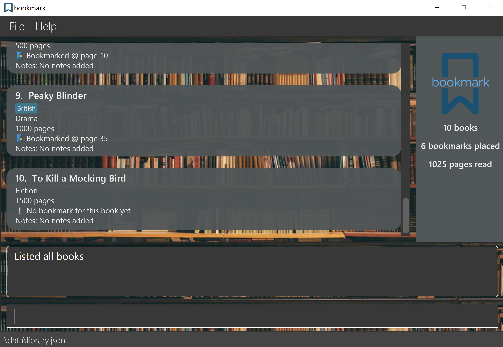
   *Exhibit 1*
   
You can find a list of all your recorded books in the main window. (Exhibit 2)  
Summarised versions of your book records will be displayed in a list. 
   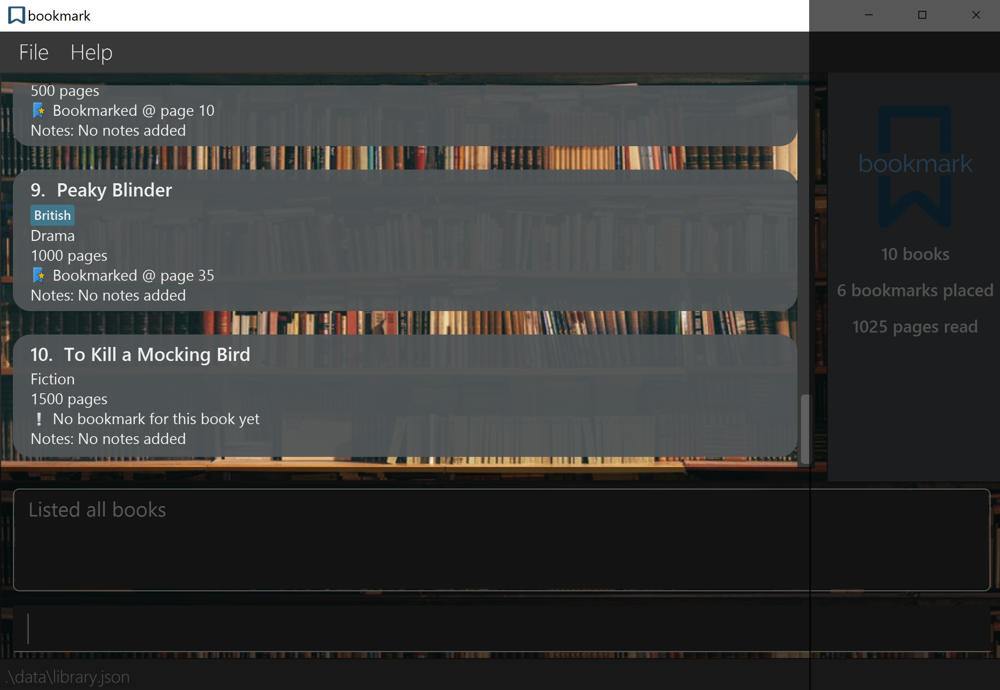
   *Exhibit 2*
   
You can also see data of the summary of all the shown books, bookmarks and pages read on the
right side of the application window. (Exhibit 3)

   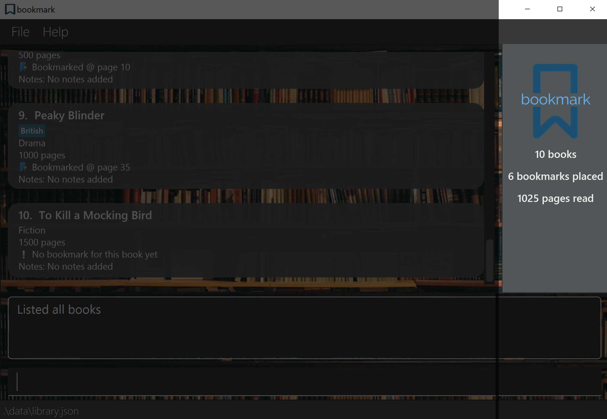
   *Exhibit 3*
   
You can start to invoke commands by typing them in the provided input box at the bottom of 
the application window. (Exhibit 4)  
 _bookmark_ will reply you with the appropriate response for each command.

   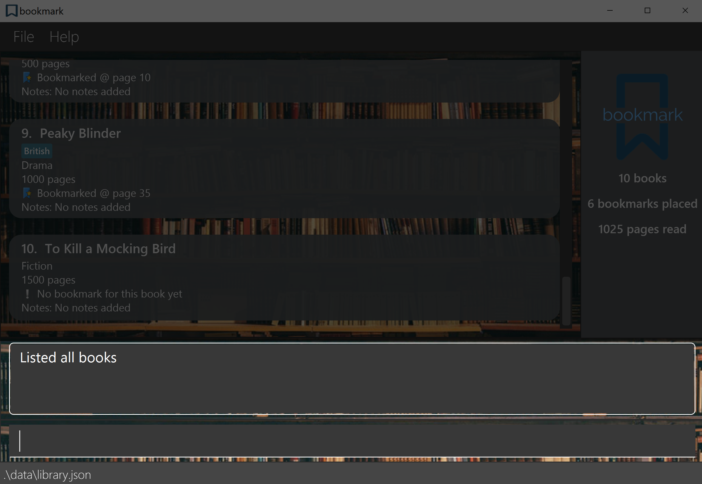
   *Exhibit 4*

Want to do more? Refer to the [Features](#features) section below for details of many more commands!

--------------------------------------------------------------------------------------------------------------------

## Prefixes

Before diving into the features, this section will provide you with some
information on what each prefix used in the features below represent.

Prefix | Explanation
-------|------------
`n/` | Name of the book / Title of the note to add to a book
`g/` | Genre of the book
`t/` | Tag attached to a book
`tp/` | Total pages of the book
`b/` | The page where the bookmark is placed at
`c/` | Completed books
`nc/` | Not completed books
`rp/` | The reading progress of the book
`p/` | The page to set your goal on
`d/` | The date to complete your goal by
`txt/` | The text of your note

## Features

**:information_source: Notes about the command format:** 

* Words in `UPPER_CASE` are the information to be given by you. 
  e.g. in `add n/BOOK_TITLE`, `BOOK_TITLE` refers to the name of the book you want to add.

* Words in square brackets are optional. 
  e.g `n/BOOK_TITLE [b/PAGE_NUMBER]` means that you can omit this if you do not want to include a bookmark. 
  You can always edit the book to have that information at a later time.

* Words with trailing `…` refers to fields that can be used multiple times. 
  e.g. `[t/TAG]…​` can be used as ` ` (i.e. 0 times), `t/friend`, `t/friend t/family` etc.

* You can enter your book information in any order you like. 
  e.g. If our command instructions specify `n/BOOK_TITLE tp/TOTAL_PAGES`, `tp/TOTAL_PAGES n/BOOK_TITLE` is also acceptable.
  
* The `INDEX` will **change based on the currently shown books on the screen.**
  For example, the `INDEX` of the first book shown will be 1, the `INDEX` of the second book shown will be 2, etc.
  If you would like to use commands on other books, please ensure they are currently displayed.

### Adding a book into _bookmark_: `add`

Add your book into _bookmark_ by using our Add Command so that you can
track your book reading progress.

:heavy_check_mark: **Format:** 

  `add n/BOOK_TITLE g/GENRE [t/TAG]... tp/TOTAL_PAGES [b/PAGE_NUMBER]`

:star: **Important Detailss:** 

   * `NAME` is limited to 1 to 120 characters.
   * `GENRE` and `TAG` only accepts Alphabets and Numbers (Special symbols like ! ? * are not supported)
   * You can add up to 10 tags
   * Adding tags and/or bookmarks is optional

Example Command | Result
-----------------|--------
`add n/Pacman g/Game strategy tp/5000` | Adds a book named `Pacman`, with genre `Game strategy`, with `5000` total pages

   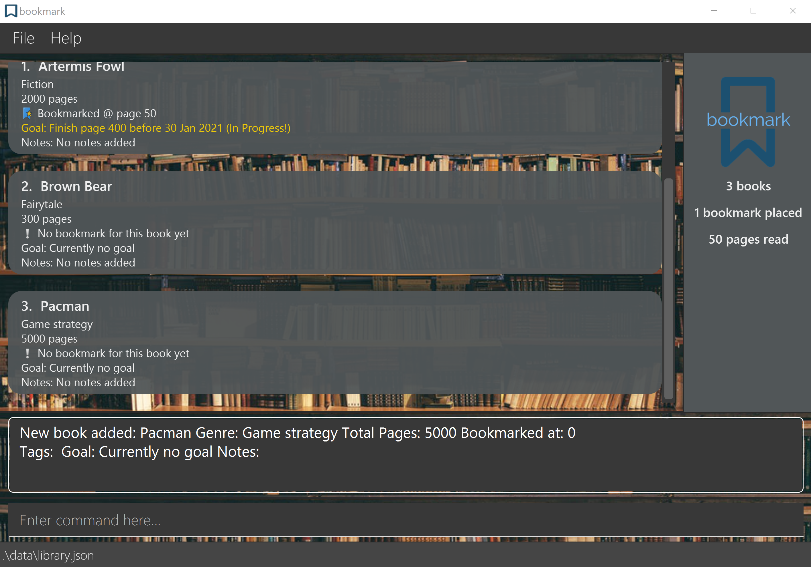

### Viewing details of a book : `view`

View detailed information such as notes of your book of choice by using the
View Command.  

:heavy_check_mark: **Format:**

   `view INDEX`

:star: **Important Detailss:** 

   * The `INDEX` refers to the index number shown in the displayed book list.
   * The `INDEX` **must be a positive number** 1, 2, 3, …
   * After using the view command, the viewed book will have an INDEX of 1 since it is the only book shown on the screen. 
      To interact with the book, use the INDEX of 1 to refer to the book.
   * If you would like to go back to see all your books, you can use the [list](#listing-all-books--list) command.

*Suppose you have at least two books currently displayed*

Example Command | Result
-----------------|--------
`view 2` | views the 2nd book in the list. 

   

### Listing all books : `list`

You can use the List Command to display all the books that you have added into _bookmark_

:heavy_check_mark: **Format:** 

   `list`

Example Command | Result
-----------------|--------
`list` | displays all books stored in _bookmark_

   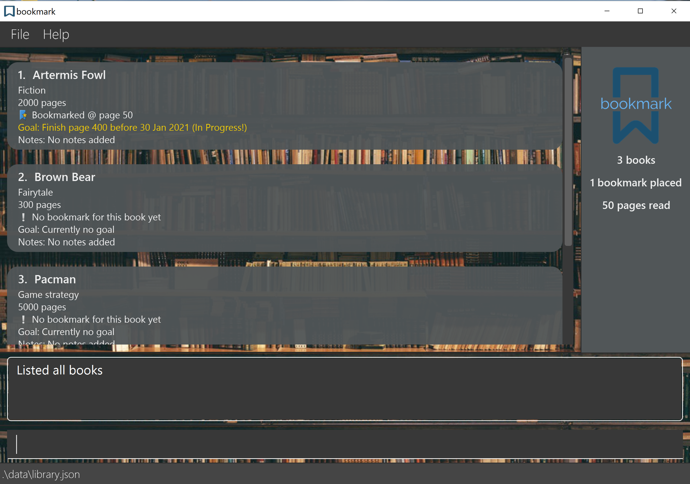 

### Locating books: `find`

You can use the Find Command to search for your book of choice
by filtering your list of books to only show those that you are searching for. 

:heavy_check_mark: **Format:** 

   `find {Field}`  
   {Field} refers to any of the following:
   * `n/BOOK_TITLE` : find by input book name
   * `g/GENRE` : find by input book genre
   * `t/TAG` : find by input tag
   * `c/` : find by completed books
   * `nc/` : find by uncompleted books

:star: **Important Detailss:** 

   * In the current version of _bookmark_ You can only find on 1 field
   * You cannot add any keywords behind `c/` and `nc/` prefix
   * You can interact with your found books with their updated `INDEX` on the displayed list. 

Example Command | Result
-----------------|--------
`find n/bear` | Returns a list of books that contain `bear` in its name.
`find t/dog cat` | Returns a list of books that contain `dog` and/or `cat` in its tags.
`find c/` | Returns a list of completed books.

   
   _Result of `find n/bear`_

#### Suggestions feature for Typing Error when finding a book

If you had misspelled your search keyword,
_bookmark_ has an automatic Suggestion feature that will recommend the closest matching word to your misspelled word 
to aid you in locating your book. 

:heavy_check_mark: **Format:** 

   This process is activated automatically when using Find command and does not require any manual inputs

:star: **Important Details:** 

   This feature is applied when finding for books using these fields: 
   * Name
   * Genre
   * Tags

Example Command | Result
-------------| ---------------
find n/Hsrry | Did you mean: Harry?
find n/Drgns | Did you mean: Dragons?

   
   _Result when Keyword: Artermis is typed wrongly_

### Sorting books: `sort` 

You can use the Sort Command to organise your bookshelf so that you can view your books
in the order you have indicated.

:heavy_check_mark: **Format:** 

`sort {Field}`  
    {Field} refers to any of the following:
   * `n/` : Sort by Name
   * `g/` : Sort by Genre
   * `b/` : Sort by bookmarked page
   * `rp/` : Sort by reading progress

:star: **Important Details:** 

   * You should not add any inputs behind the prefixes
   * You can interact with your sorted books with their updated `INDEX` on the displayed list. 

Example Command | Result
-----------------|--------
`sort n/` | Returns a list of books sorted by name in alphabetical order.
`sort g/` | Returns a list of books sorted by genre in alphabetical order.
`sort b/` | Returns a list of books sorted by ascending number of pages read.
`sort rp/` | Returns a list of books sorted by ascending reading progress.

   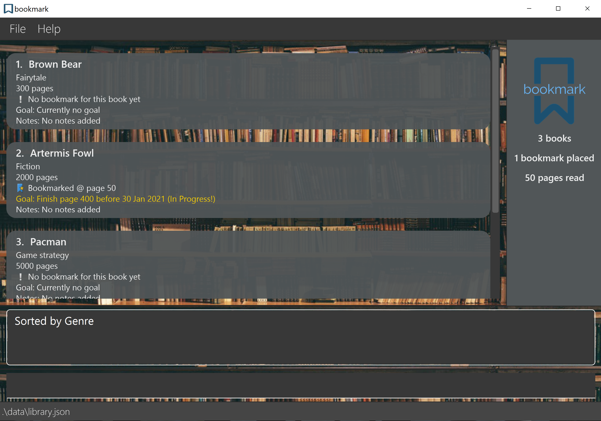
   _Result of `sort g/`_

### Deleting a book : `delete`

You can use the Delete Command to delete unwanted books from _bookmark_ so that 
you remove books that you no longer want to track. 

:heavy_check_mark: **Format:** 

    `delete INDEX`

:star: **Important Details:** 

   * Deletes the book at the specified `INDEX`.
   * The `INDEX` refers to the index number shown in the displayed book list.
   * The `INDEX` **must be a positive number** 1, 2, 3, …
   * Be aware that deleted books will not be retrievable after you restart the application or 
     call more than 10 commands after deletion.

*Suppose you have at least two books currently displayed*

Example Command | Result
-----------------|--------
`delete 2` | deletes the 2nd book in the book list. 

| What you should see |
| --------------- |
| Before `delete 2` |
| 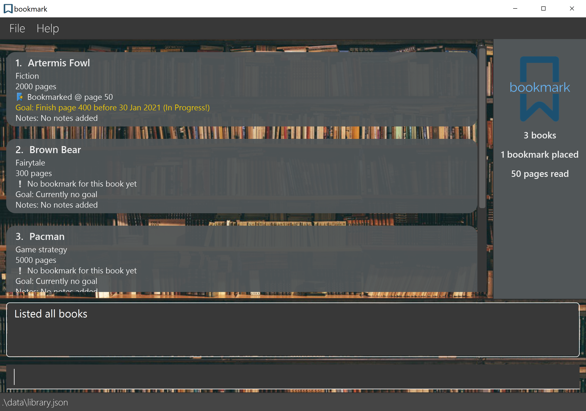 |
| After `delete 2` | 
| 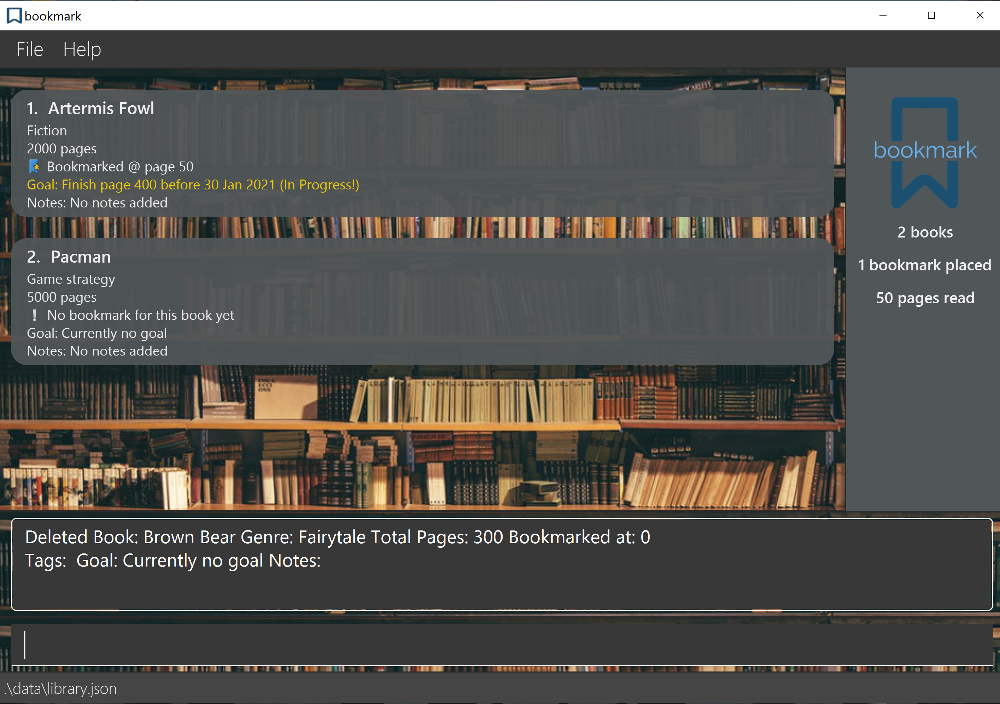 | 

### Editing a book : `edit`

You can use the Edit Command to update information of a book so that
you can keep your books up to date. 

:heavy_check_mark: **Format:** 

`edit INDEX [n/BOOK_TITLE] [tp/TOTAL_PAGES] [b/PAGE_NUMBER] [g/GENRE] [t/TAG]` 

:star: **Important Details:** 

   * Edit the book at the specified `INDEX`.
   * The `INDEX` refers to the index number shown in the displayed book list.
   * The `INDEX` **must be a positive number** 1, 2, 3, …​
   * At least one of the fields must be provided.
   * Existing values will be updated to the input values.

*Suppose you have at least two books currently displayed*

Example Command | Result
-----------------|--------
`edit 2 n/Harry Potter g/Fantasy` | Edits the name and genre of the 2nd book to `Harry Potter` and `Fantasy` respectively.
`edit 2 b/250` | Edits the bookmark of the 2nd book to be `250`. 

| What you should see |
| ------------------- |
| Before `edit 2 b/250` |
|  |
| After `edit 2 b/250` |  
| 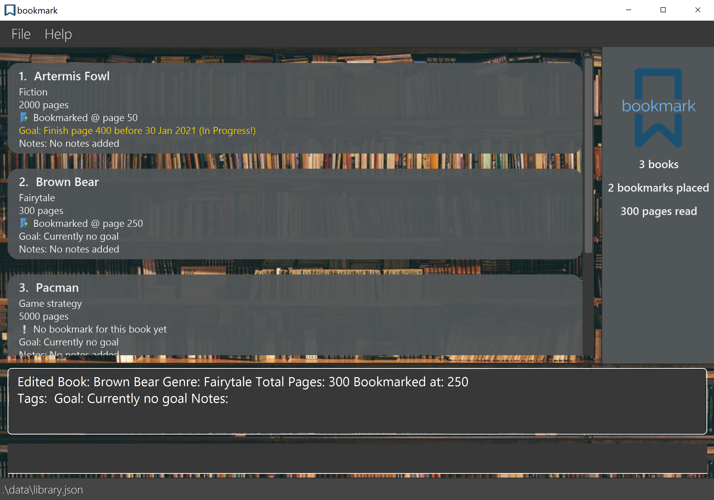 | 

### Set goal for your book: `goal`

You can use the Goal Command to set a reading goal to your chosen book so that 
you can motivate yourself to read.

:heavy_check_mark: **Format:** 

`goal INDEX p/PAGE d/DD-MM-YYYY` 

:star: **Important Details:** 

   * Sets goal for the book at the specified `INDEX`.
   * The `INDEX` refers to the index number shown in the displayed book list.
   * The `INDEX` **must be a positive number** 1, 2, 3, …
   * If you add a goal to a book with an existing goal, the newly added goal will replace it.
   * You can only set dates that have not passed
   * Your goal is displayed in yellow, green or red for in progress, completed or overdue.
    
   Goal In Progress:
    
    
   Goal Completed:
    
    
   Goal Overdue:
    

Example Command | Result
-----------------|--------
`goal 3 p/69 d/22-11-2020` | Sets a goal to reach page 69 of the 3rd book by 22nd November 2020.

   

### Remove your Goal: `goaldel`

You can use the Goal Delete command to remove the previously set goal from
a book so that you can remove unwanted goals.

:heavy_check_mark: **Format:** 

   `goaldel INDEX`

:star: **Important Details:** 

   * Removes goal for the book at the specified `INDEX`.
   * The index refers to the index number shown in the displayed book list.
   * The index **must be a positive number** 1, 2, 3, …​

*Suppose you have at least one book currently displayed*

Example Command | Result
-----------------|--------
`goaldel 1` | Goal successfully removed for Harry Potter. 

| What you should see |
| ------------------- |
| Before `goaldel 1` |
|  |
| After `goaldel 1` |
| 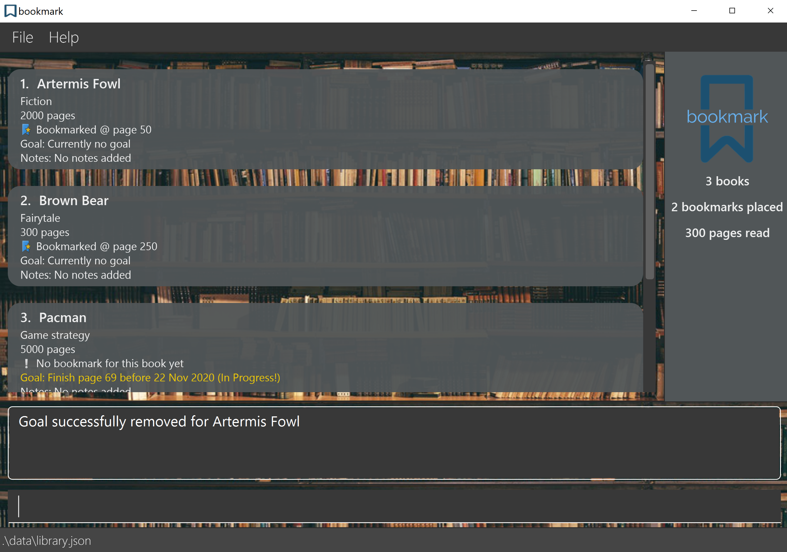 | 

### Adding a note to a book : `note`

You can use the Note Command to add notes to your book so that you can pen down your thoughts and reflections.

:heavy_check_mark: **Format:** 

`note INDEX n/TITLE txt/TEXT` 

:star: **Important Details:** 

   * `TITLE` and `INDEX` must not start with a whitespace.
   * `TITLE` is limited to 1 to 120 characters.
   * `TEXT` is limited to 1 to 1000 characters.
   * Edits the book at the specified `INDEX`.
   * The index refers to the index number shown in the displayed book list.
   * The index **must be a positive number** 1, 2, 3, …​

*Suppose you have at least one book currently displayed*

Example Command | Result
-----------------|--------
`note 1 n/Thoughts txt/What is he thinking!` | Adds a note to the first book shown with the title `Thoughts` and text `What is he thinking!` 

| What you should see |
| ------------------- |
| Before `note 1 n/Thoughts txt/What is he thinking!` |
|  |
| After `note 1 n/Thoughts txt/What is he thinking!` |
| 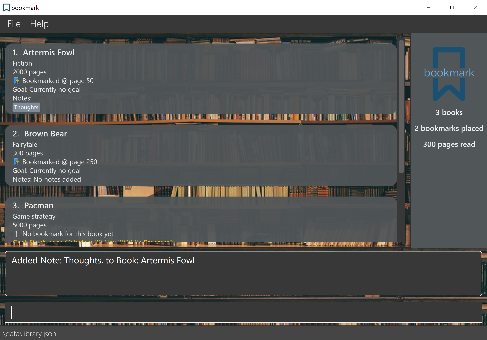 | 

### Deleting a note from a book : `notedel`

You can use the Delete Note command to delete notes so that you can
remove unwanted notes from _bookmark_.

:heavy_check_mark: **Format:** 

`notedel INDEX NOTE_INDEX`

:star: **Important Details:** 

   * Deletes the note at the specified `NOTE_INDEX` of the book specified at `INDEX`.
   * The `INDEX` refers to the index number shown in the displayed book list.
   * The `NOTE_INDEX` refers to the index number shown in the displayed notes in the detailed view.
   * All indexes **must be a positive number** 1, 2, 3, …​

*Suppose you have at least two books currently displayed*

Example Command | Result
-----------------|--------
`notedel 1 3` | Deletes the 3rd note of the 1st book displayed
`notedel 4 2` | Deletes the 4th note of the 2nd book displayed 

| What you should see |
| ------------------- |
| Before `notedel 1 3` |
| 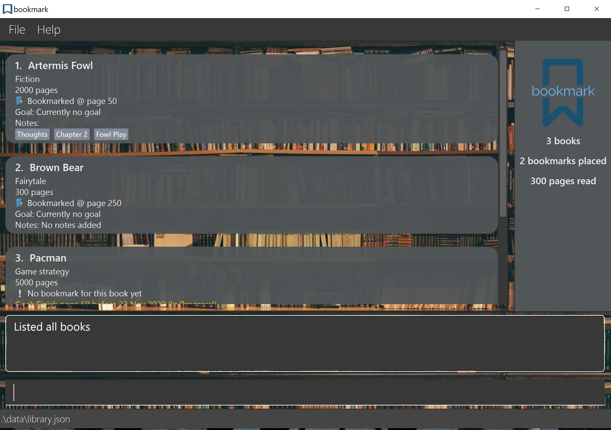 |
| After `notedel 1 3` |
| 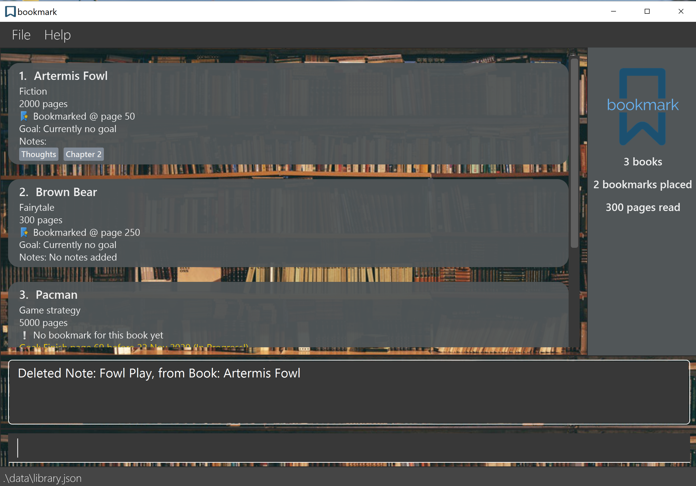 | 
 

### Undoing a command : `undo`

You can use the Undo Command to revert previous commands so that you can
correct your mistakes. 

:heavy_check_mark: **Format:** 

   `undo`

:star: **Important Details:** 

   * All commands can be undone except the following:  
     * `exit`
     * `help`
   * You can undo as many as 10 previous actions.

Example Command | Result
--------------- | ----------
`undo` | Previous version is restored

:warning: **Warning:** 

   The undo command will not execute if there are no commands available to undo. Once you close _bookmark_, the commands
   entered during your last usage session cannot be undone using the `undo` command when you start the application again.

  

| What you should see |
| ------------------- |
| Before `undo` |
| 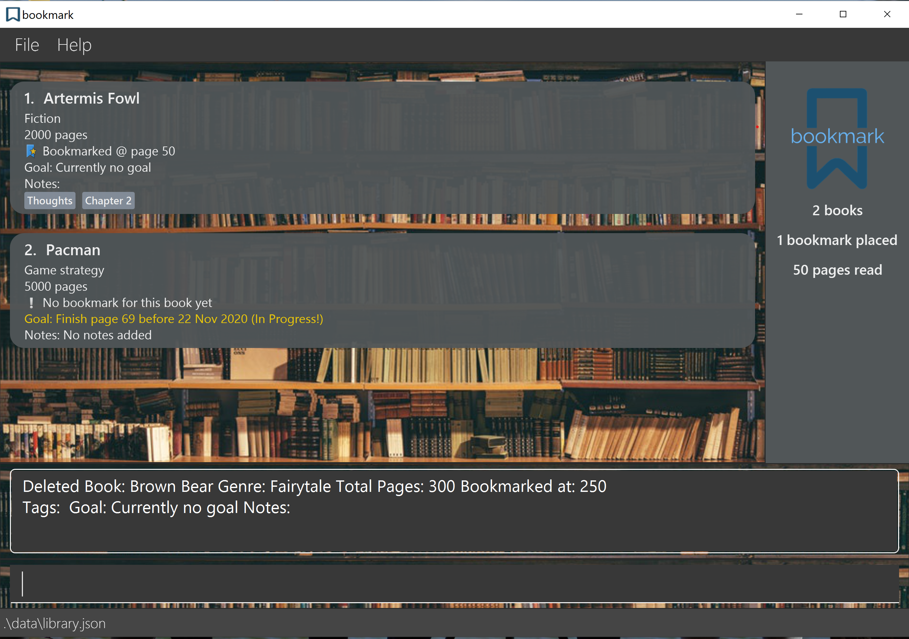 |
| After `undo` | 
| 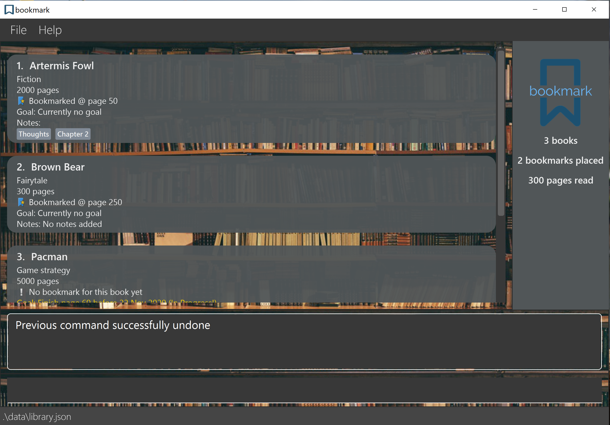 | 

### Redoing a command: `redo`

You can use the Redo Command to reinstate previously undone commands.

:heavy_check_mark: **Format:** 

   `redo`

:star: **Important Details:** 

   * This command can be used multiple times consecutively to redo up to ten undone commands.   
     You should use `redo` in conjunction with the [undo](#undoing-a-command--undo) command. 
   * All commands can be redone except the following:  
     * `exit`
     * `help`

 
 
 
Example Command | Result
--------------- | ----------
`redo` | Previously undone command is invoked again 

_when redo is called on a deleted book (previously undone)_  

| What you should see |
| ------------------- |
| Before `redo` |
|  |
| After `redo` |
| 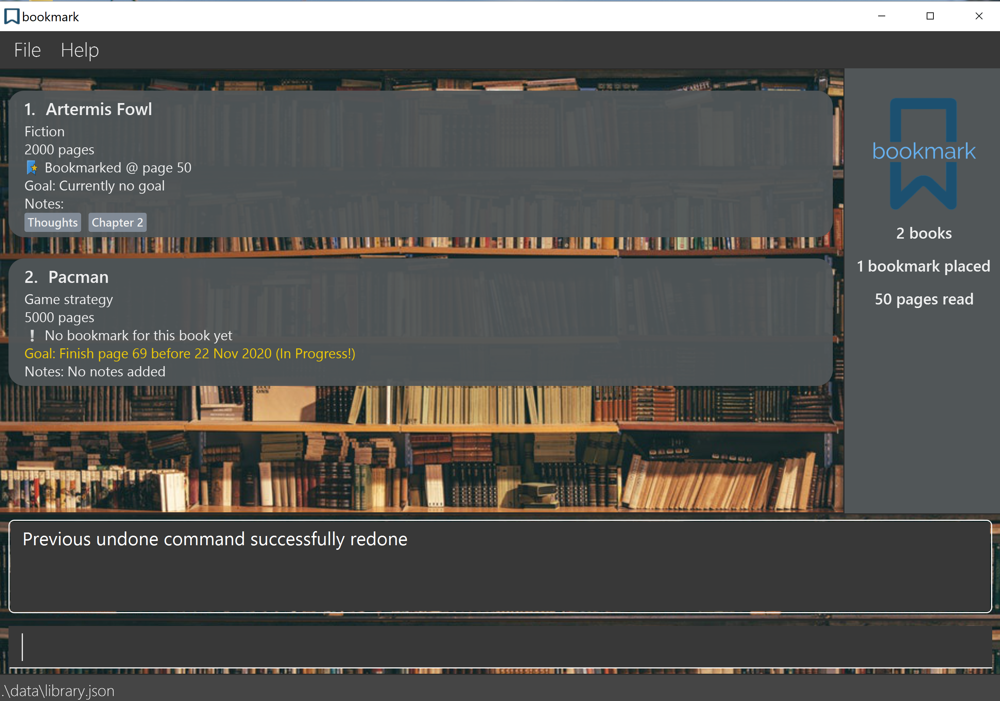 | 

:warning: **Warning:** 

   The redo command will not execute if there are no undone commands available to redo. Once _bookmark_ is closed, the
   commands that have been undone during your last usage session cannot be redone using the `redo` command when you
   start _bookmark_ again.

### Clearing all books : `clear`

You can use the Clear Command to delete all your books at once.

:heavy_check_mark: **Format:** 

   `clear`

  

:warning: **Warning: ** 

   Take caution! While the undo feature will help you restore books deleted by `clear`, you will not be able
   to recover your deleted books if you call too many commands (10 and more) after clearing!

### Saving the data

_bookmark_ data will be saved in the hard disk automatically after any command that changes the data is called.
 There is no need to save manually.

### Accessing Help : `help`

You can use the Help Command to access the Help window so that you can quickly
find details to the commands that _bookmark_ supports.

:heavy_check_mark: **Format:** 

   `help`

:star: **Important Details:** 

   You can also press `F1` on your keyboard or click on `help` on the navigation bar located at the top of the window.

Example Command | Result
-----------------|--------
`help` | Help Window opens

 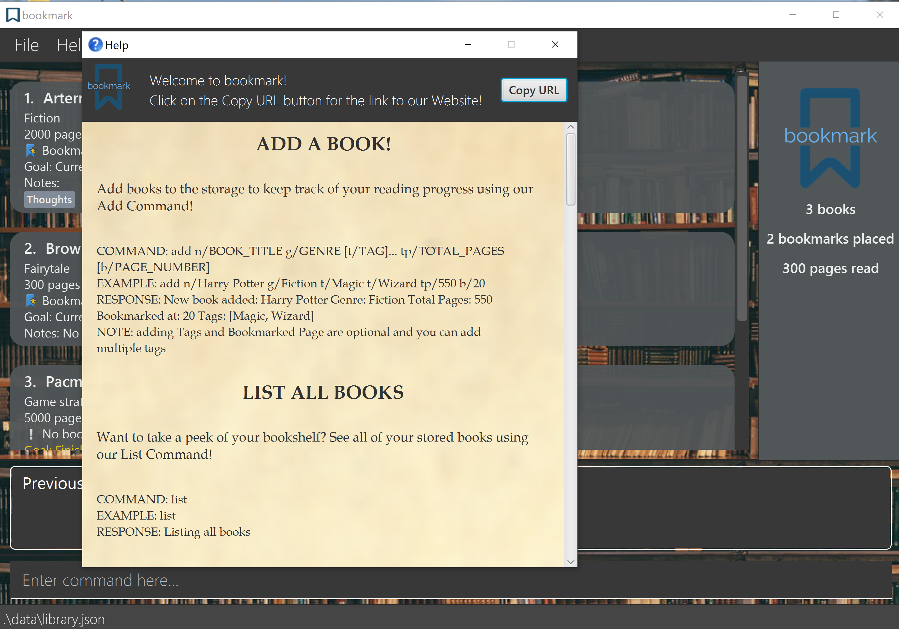

### Exiting the program : `exit`

You can use the Exit Command to quickly exit _bookmark_.
 

:heavy_check_mark: **Format:** 

   `exit`

Example Command | Result
---------------- | ---------
`exit` | Exits _bookmark_

--------------------------------------------------------------------------------------------------------------------

## FAQ

**Q**: How do I transfer my data to another Computer? 
**A**: Install the app in the other computer and overwrite the empty data file it creates with the 
`library.json` file located in the `data` file of your previous bookmark home folder.

**Q**: How many books can I add to _bookmark_?  
**A**: You can add a total of 100 books to _bookmark_.

**Q**: How can I know more about the available commands that _bookmark_ supports? 
**A**: Type `help` to open up the Help Window where the available commands will be shown.

--------------------------------------------------------------------------------------------------------------------

## Command summary

Action | Format
--------|------------------
**[Add](#adding-a-book-into-_bookmark_-add)** | `add n/BOOK_TITLE g/GENRE [t/TAG] tp/TOTAL_PAGES [b/PAGE_NUMBER]`
**[View](#viewing-details-of-a-book--view)** | `view INDEX`
**[List](#listing-all-books--list)** | `list`
**[Find](#locating-books-find)** | `find n/BOOK_TITLE`, `find g/GENRE`, `find t/TAG`, `find c/`, `find nc/`
**[Sort](#sorting-books-sort)** | `sort n/`, `sort g/`, `sort b/`, `sort rp/`
**[Delete](#deleting-a-book--delete)** | `delete INDEX`
**[Edit](#editing-a-book--edit)** | `edit INDEX [n/BOOK_TITLE] [tp/TOTAL_PAGES] [b/PAGE_NUMBER] [g/GENRE] [t/TAG]`
**[Add Goal](#set-goal-for-your-book-goal)** | `goal INDEX p/PAGE d/DD-MM-YYYY`
**[Delete Goal](#remove-your-goal-goaldel)** | `goaldel INDEX`
**[Add Note](#adding-a-note-to-a-book--note)** | `note INDEX n/TITLE txt/TEXT`
**[Delete Note](#deleting-a-note-from-a-book--notedel)** | `notedel INDEX NOTE_INDEX`
**[Undo](#undoing-a-command--undo)** | `undo`
**[Redo](#redoing-a-command-redo)** | `redo`
**[Clear](#clearing-all-books--clear)** | `clear`
**[Exit](#exiting-the-program--exit)** | `exit`
**[Help](#accessing-help--help)** | `help`

## Glossary

Term | Meaning
-------- | ------------
**Genre** | The classification of the book   (eg. Fiction, Nonfiction, Selfhelp etc.)
**Tag** | Short descriptive words to describe your book   (eg. Fun, Exciting, Magic)
**Note** | Short paragraphs written by you to be added to your stored book records.
**Goal** | A date set by you to finish a certain page of the book
**Reading Progress** | The percentage of the book completed
