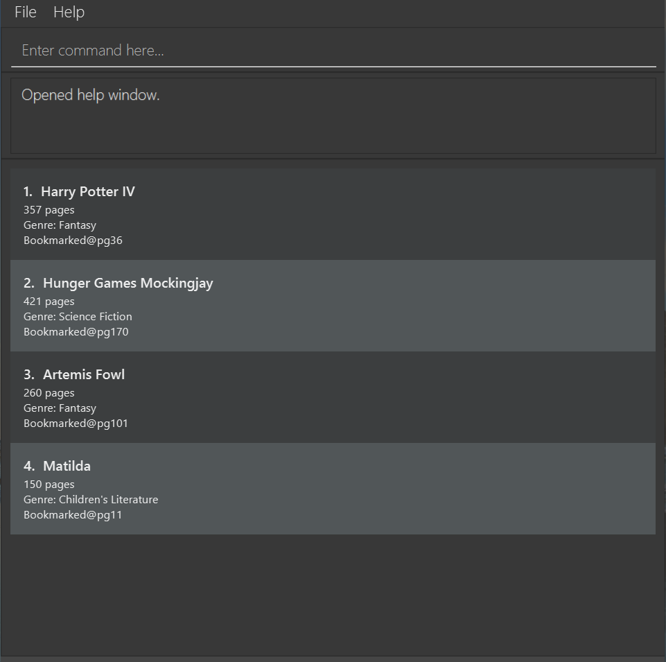

## bookmark v1.4
Have you ever lost track of where you stopped reading your last book or misplaced your bookmark?
Fret no more, **bookmark** is here to save the day! 
**bookmark** (not your regular bookmark!) is a desktop app for tracking reading progress. It allows you to centralise all your
reading progress into one place.
Example usages:
* Adding a book and its current bookmark
* View a specific book and its details
* Update the details of a specified book
* Delete a specified book
* Listing all books in the application
* Add notes to books
* Set reading goals

**bookmark is a desktop application for managing your books and reading progress.** While it has a GUI, most of the user interactions happen using a CLI (Command Line Interface).

## User Guide
Interested to try out the application? Head over to the [User Guide](https://ay2021s1-cs2103t-f13-2.github.io/tp/UserGuide.html)
to get started!
## Developer Guide
bookmark is an open source project and we welcome contributions from the community. Head over to the
[Developer Guide](https://ay2021s1-cs2103t-f13-2.github.io/tp/DeveloperGuide.html) to get started!
## Acknowledgements
This project is based on the AddressBook-Level3 project created by the [SE-EDU initiative](https://se-education.org).
Libraries used: [JavaFX](https://openjfx.io/), [Jackson](https://github.com/FasterXML/jackson), [JUnit5](https://github.com/junit-team/junit5)
 
Icons from [Flaticon](https://www.flaticon.com/free-icon/bookmark_807354?term=bookmark&page=2&position=43) and
[Icons8](https://icons8.com/icons/set/white-exclamation-mark-emoji")  
Background splash image from [Unsplash](https://unsplash.com/photos/YLSwjSy7stw) 

